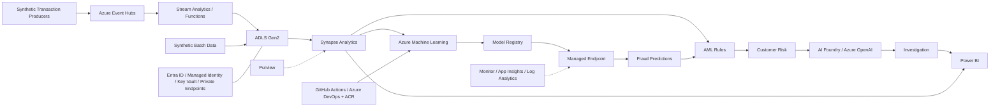

# Azure Financial Crime Risk Intelligence Platform

**A local-first financial-crime analytics platform that turns synthetic banking activity into explainable fraud, AML, customer-risk, investigation, monitoring, and executive intelligence, with a secure Azure deployment blueprint.**

> Portfolio reference implementation. All data is synthetic. No live Azure or Power BI deployment exists, no credentials are required, and no production-readiness or regulatory-approval claim is made.

## Executive Summary

Banks and FinTechs need to detect suspicious activity quickly without sacrificing data quality, traceability, explainability, security, or human judgment. This project connects fraud modelling, AML scenarios, customer risk, investigation support, monitoring, and executive reporting into one auditable evidence chain from source transaction to decision-support output.

The complete analytical pipeline is implemented locally in Python using deterministic synthetic data. Azure architecture, Bicep modules, Azure ML YAML, streaming examples, security controls, governance, and MLOps are documented deployment mappings only; they demonstrate a credible production path without provisioning resources, using credentials, or claiming a live cloud environment.

## Architecture



See the [full reference architecture](diagrams/azure_reference_architecture.md), [Mermaid source](diagrams/azure_reference_architecture.mmd), and [architecture decisions](docs/architecture_decisions/). The diagram shows a target Azure design; the working implementation remains local.

## Platform Capabilities

- Deterministic synthetic customers, accounts, sessions, transactions, labels, and watchlist alerts
- Schema, key, relationship, range, timestamp, categorical, and privacy validation
- Prior-only behavioural, velocity, geographic, device, account, and customer features
- Chronological, imbalance-aware Logistic Regression fraud baseline and threshold analysis
- Ten configurable AML scenarios with structured evidence and customer exposure summaries
- Transparent five-component customer risk scoring with reconstructable contributions
- Exact linear-model contribution reconstruction and investigator reason codes
- Evidence-grounded deterministic investigation assistance with human-review controls
- Data, drift, model, AML, risk, explainability, GenAI, and pipeline monitoring
- Power BI-ready dimensions, facts, aggregates, KPIs, DAX, and semantic-model design
- Azure architecture, security, governance, MLOps, CI/CD, IaC, and operational runbooks

## End-to-End Lifecycle

**Synthetic data → validation → feature engineering → fraud and AML analytics → customer risk → explainability → investigations → monitoring → Power BI**

See the [portfolio evidence matrix](docs/portfolio_evidence.md) for milestone-by-milestone implementation evidence.

## Headline Results

### Fraud Baseline

- Chronological, class-balanced Logistic Regression baseline
- Approximately **0.43 ROC AUC** and **0.03 precision** in the latest synthetic run
- Intentionally retained as a weak baseline to expose threshold, false-positive, label, and monitoring challenges
- Evidence: [fraud baseline model report](reports/fraud_baseline_model_report.md)

### AML Rules

- **10 configurable rules** generated **3,549 alerts** across **1,468 synthetic transactions**
- High alert coverage also creates a substantial false-positive and investigator workload requiring governed tuning
- Evidence: [AML rule engine report](reports/aml_rule_engine_report.md)

### Customer Risk

- **50 synthetic customers** scored using **5 transparent components**
- Latest run: **1 critical** and **14 high-risk** customers
- Scores support human review only and do not establish wrongdoing or authorise adverse action
- Evidence: [customer risk scoring report](reports/customer_risk_scoring_report.md)

### Explainability

- **367 transactions explained; 367 passed and 0 failed** reconstruction checks
- Decision scores and probabilities reconstruct exactly from model contributions
- Explanations describe model mechanics and association, not causation
- Evidence: [fraud model explainability report](reports/fraud_model_explainability_report.md)

### GenAI-Assisted Investigations

- `deterministic_template` mode produced **5 evidence-grounded cases** and training-only SAR-style drafts
- No network calls or external models; every output requires human review
- Evidence: [GenAI grounding quality](outputs/genai_grounding_quality.json)

### Monitoring

- Overall platform status: **warning**
- **84 healthy**, **8 warning**, and **0 critical** controls in the latest run
- Evidence: [platform monitoring report](reports/platform_monitoring_report.md)

### Power BI-Ready Reporting

- **7 dimensions**, **9 fact tables**, **6 aggregate tables**, and **21 executive KPIs**
- No `.pbix` file or Power BI Service deployment
- Evidence: [semantic model specification](dashboard/semantic_model_spec.md)

## Azure Service Mapping

| Capability | Local implementation | Azure deployment equivalent |
| --- | --- | --- |
| Stream ingestion | Transaction JSONL | Azure Event Hubs |
| Stream processing | Validation and rule Python | Stream Analytics / Azure Functions |
| Data lake | `data/`, `outputs/` | ADLS Gen2 zoned storage |
| Analytics | pandas features and aggregates | Azure Synapse Analytics |
| ML lifecycle | sklearn scripts, model, and metadata | Azure Machine Learning and Model Registry |
| Online serving | Local batch predictions | Azure ML Managed Online Endpoint |
| Investigation drafting | Deterministic templates | Azure AI Foundry / Azure OpenAI with human approval |
| Secrets and identity | No secrets required | Key Vault, Entra ID, Managed Identities |
| Observability | Monitoring CSV, JSON, and reports | Azure Monitor, Application Insights, Log Analytics |
| Reporting | Governed CSV star model | Power BI semantic model |
| Governance | Dictionaries, lineage, and audit outputs | Microsoft Purview |
| CI/CD and images | GitHub Actions | GitHub Actions / Azure DevOps and ACR |

## Power BI-Ready Analytics

The reporting layer uses deterministic surrogate keys, privacy-minimised dimensions, narrow facts, reconciled aggregates, explicit KPI definitions, production-style DAX examples, and single-direction relationship guidance. Quality gates reconcile transaction, AML, customer-risk, investigation, and monitoring counts before publication.

Review the [semantic model](dashboard/semantic_model_spec.md), [DAX measures](dashboard/dax_measures.md), [KPI definitions](dashboard/kpi_definitions.md), and [dashboard specification](dashboard/executive_dashboard_spec.md). These are import-ready CSV and design artifacts, not a deployed Power BI model.

## Security, Governance and MLOps

- Microsoft Entra ID and managed identities replace long-lived workload credentials
- Least-privilege RBAC, PIM, access reviews, and Key Vault protect privileged operations and secrets
- Private endpoints, VNet integration, disabled public access, TLS, and encryption protect service boundaries
- Microsoft Purview maps classification, ownership, raw-to-reporting lineage, and retention controls
- CI/CD and model lifecycle controls cover validation, approval, registration, promotion, monitoring, rollback, and retirement
- Human approval, immutable evidence, incident response, and runbooks govern financial-crime and generated-narrative use

See [security architecture](docs/security_architecture.md), [threat model](docs/threat_model.md), [data governance and lineage](docs/data_governance_and_lineage.md), and [MLOps lifecycle](docs/mlops_lifecycle.md). These are design mappings, not evidence of a live deployed or certified environment.

## Quick Start

Python **3.11+** is required. Azure credentials are neither needed nor read.

```bash
python3.11 -m venv .venv
source .venv/bin/activate
python3 -m pip install -r requirements.txt
./scripts/run_all_local.sh
```

The workflow regenerates all synthetic evidence, validates infrastructure statically, runs the final audit, executes pytest, and runs Ruff. After dependency installation it requires no network access.

```bash
python3 scripts/validate_infrastructure.py
python3 scripts/run_final_audit.py
python3 -m pytest
python3 -m ruff check .
```

## Repository Structure

```text
src/                 Local Python implementation
configs/             Versioned analytical configuration
data/                Synthetic samples and generated local data zones
outputs/, reports/   Machine- and human-readable evidence
dashboard/           Power BI-ready model, DAX, KPIs, and specifications
diagrams/            Mermaid Azure reference architecture
infra/               Non-deploying modular Bicep scaffold
azureml/             Illustrative jobs, components, pipelines, and endpoints
deployment/          Event schema, streaming SQL, and Function placeholder
docs/                Technical, governance, portfolio, and runbook material
scripts/             Local CLIs, infrastructure validation, and final audit
tests/               Automated tests across all 12 milestones
.github/              CI, security assurance, and dependency updates
```

## Testing and Quality

Latest final audit evidence:

- **126 tests passed**
- Ruff passed
- Python syntax compilation passed
- Infrastructure validation: **7/7**
- Final quality audit: **19/19**
- All **12 milestones** represented

Review the [final quality audit](reports/final_quality_audit.md), [machine-readable audit](outputs/final_quality_audit.json), and [final project report](reports/final_project_report.md).

## Known Limitations

- All data and outcomes are synthetic and do not represent a real institution.
- Fraud performance is weak, and threshold selection is demonstration-only.
- AML rules generate a high false-positive rate without real investigator dispositions.
- Customer risk scoring is an illustrative methodology, not a validated production risk model.
- Explainability covers a linear baseline and is non-causal.
- GenAI assistance is deterministic only; Azure OpenAI and AI Foundry integration is not implemented.
- There is no live Azure deployment or live Power BI deployment.
- No production load, resilience, penetration, or cost validation has been completed.
- Bicep and Azure ML mappings are illustrative and require subscription-specific configuration and formal review.
- The project is not regulator-approved, certified, or production-ready.

## Target Roles

Financial Crime Analytics Engineer · Fraud Data Scientist · AML Analytics Specialist · Risk ML Engineer · Azure Data Engineer · MLOps Engineer

## Portfolio Guides

- [Hiring-team summary](docs/recruiter_summary.md)
- [Interview guide](docs/interview_guide.md)
- [Demo guide](docs/demo_guide.md)
- [Portfolio evidence matrix](docs/portfolio_evidence.md)

## Synthetic Data Disclaimer

Every entity and outcome in this repository is fictional and synthetically generated. No real banking, customer, sanctions, device, card, or personal data is used. Outputs are educational portfolio evidence only and must not be interpreted as findings about real people, entities, countries, or institutions.
