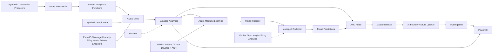

# Azure Financial Crime Risk Intelligence Platform

**A local-first, end-to-end financial-crime analytics platform that turns synthetic banking activity into explainable fraud, AML, customer-risk, investigation, monitoring, and executive intelligence, with a secure Azure deployment blueprint.**

> Portfolio reference implementation. All data is synthetic. No live Azure or Power BI deployment exists, no credentials are required, and no regulatory or production-readiness claim is made.

## Executive Summary

This repository demonstrates how a bank or FinTech could organise financial-crime data and controls across the complete analytical lifecycle. It generates linked synthetic customers, accounts, sessions, and transactions; validates them; builds leakage-aware features; trains and explains a fraud baseline; evaluates AML scenarios; scores customer risk; drafts grounded investigation material; monitors platform health; and publishes a governed Power BI-ready model.

The implemented Python pipeline runs locally and deterministically. The Azure architecture, Bicep modules, Azure ML YAML, streaming examples, security model, MLOps lifecycle, and operating runbooks are deployment mappings only. This separation keeps the project reproducible while showing the controls required for a future institution-specific cloud implementation.

## Business Problem

Financial-crime teams must detect suspicious patterns quickly without sacrificing traceability, data quality, security, model governance, or human judgment. Fraud models, AML scenarios, customer risk, explanations, investigations, and executive reporting are often fragmented. This project treats them as one governed evidence chain, from source event to decision support and KPI.

## Platform Capabilities

- Deterministic synthetic banking data with linked customers, accounts, transactions, sessions, labels, and watchlist alerts
- Schema, key, relationship, range, timestamp, categorical, and privacy validation
- Prior-only behavioural, velocity, geographic, device, account, and customer features
- Imbalance-aware Logistic Regression fraud baseline with temporal split and threshold analysis
- Ten configurable AML transaction-monitoring scenarios with structured evidence
- Transparent five-component customer financial-crime risk scoring
- Exact linear-model contribution reconstruction and investigator reason codes
- Grounded deterministic investigation summaries and training-only SAR-style drafts
- Data, feature, model, AML, risk, explainability, GenAI, and pipeline monitoring
- Power BI-ready star model with governed KPIs, DAX examples, and reconciliation
- Azure reference architecture, Bicep, Azure ML mappings, security, lineage, MLOps, CI/CD, and runbooks

## Architecture



See [the full reference architecture](diagrams/azure_reference_architecture.md), [Mermaid source](diagrams/azure_reference_architecture.mmd), and [architecture decisions](docs/architecture_decisions/).

## End-to-End Workflow

1. Generate reproducible synthetic entities and transaction events.
2. Ingest CSV/JSONL and block invalid schemas, keys, relationships, values, and timestamps.
3. Build prior-only transaction, account, and customer features with lineage metadata.
4. Train a chronological fraud baseline and evaluate imbalance-aware metrics and thresholds.
5. Evaluate explainable AML scenarios and aggregate customer exposure.
6. Combine bounded KYC, behavioural, AML, fraud-model, and device components into risk scores.
7. Reconstruct model decisions and generate non-causal reason evidence.
8. Assemble minimised evidence and produce deterministic, human-review investigation drafts.
9. Monitor quality, drift, performance, control integrity, safety, and pipeline health.
10. Publish reconciled dimensions, facts, aggregates, KPI definitions, and DAX examples.
11. Map local boundaries to secured Azure services and governed deployment lifecycles.
12. Run infrastructure and final portfolio audits, pytest, and Ruff.

## Implemented Features

| Milestone | Implementation | Representative evidence |
| --- | --- | --- |
| 1–3 | Scaffold, synthetic data, ingestion and validation | `data/samples/`, `reports/data_validation_report.md` |
| 4 | Leakage-aware feature engineering | `data/processed/feature_dictionary.csv` |
| 5 | Fraud baseline | `reports/fraud_baseline_model_report.md` |
| 6 | AML rule engine | `docs/aml_controls_matrix.md`, `outputs/aml_rule_summary.csv` |
| 7 | Customer risk scoring | `outputs/customer_risk_components.csv` |
| 8 | Model explainability | `reports/fraud_model_explainability_report.md` |
| 9 | GenAI-assisted investigation | `reports/investigation_cases/`, grounding quality JSON |
| 10 | Monitoring and drift | `reports/platform_monitoring_report.md` |
| 11 | Power BI-ready reporting | `dashboard/semantic_model_spec.md`, `dashboard/powerbi_data/` |
| 12 | Azure architecture and assurance | `infra/`, `azureml/`, threat model, ADRs, runbooks, final audit |

## Azure Service Mapping

| Capability | Local implementation | Azure deployment equivalent |
| --- | --- | --- |
| Stream ingestion | Transaction JSONL | Azure Event Hubs |
| Stream processing | Validation/rule Python | Stream Analytics / Azure Functions |
| Data lake | `data/`, `outputs/` | ADLS Gen2 zoned storage |
| Analytics | pandas features and aggregates | Azure Synapse Analytics |
| ML lifecycle | sklearn scripts/model/metadata | Azure Machine Learning and Model Registry |
| Online serving | Local batch predictions | Azure ML Managed Online Endpoint |
| Investigation drafting | Deterministic templates | Azure AI Foundry / Azure OpenAI with human approval |
| Secrets and identity | No secrets required | Key Vault, Entra ID, Managed Identities |
| Observability | Monitoring CSV/JSON/reports | Azure Monitor, Application Insights, Log Analytics |
| Reporting | Governed CSV star model | Power BI semantic model |
| Governance | Dictionaries, lineage, audit outputs | Microsoft Purview |
| CI/CD and images | GitHub Actions | GitHub Actions/Azure DevOps and ACR |

## Repository Structure

```text
src/                 Local Python implementation
configs/             Versioned analytical configuration
data/                Synthetic samples and generated local zones
outputs/, reports/   Machine- and human-readable evidence
dashboard/           Power BI-ready model, DAX, KPIs, dashboard specifications
diagrams/            Mermaid Azure reference architecture
infra/               Non-deploying modular Bicep scaffold
azureml/             Illustrative Azure ML jobs, components, pipeline, endpoint mappings
deployment/          Event schema, streaming SQL, and non-networking Function placeholder
docs/                Design, governance, model, portfolio, interview, and runbook material
scripts/             Local CLIs, infrastructure validation, and final audit
tests/               Automated tests across all 12 milestones
.github/              CI, security assurance, and dependency-update configuration
```

## Quick Start

Python 3.11 or newer is required. Azure credentials are neither needed nor read.

```bash
python3.11 -m venv .venv
source .venv/bin/activate
python3 -m pip install -r requirements.txt
./scripts/run_all_local.sh
```

The full workflow generates synthetic data and all downstream evidence, validates infrastructure statically, runs the final audit, executes pytest, and runs Ruff. After dependency installation it requires no network access.

Individual final checks:

```bash
python3 scripts/validate_infrastructure.py
python3 scripts/run_final_audit.py
python3 -m pytest
python3 -m ruff check .
```

## Sample Outputs

- Data quality: `reports/data_validation_report.md`
- Fraud model: `outputs/fraud_model_metrics.json`
- AML operations: `outputs/aml_transaction_alerts.csv`
- Customer risk: `outputs/customer_risk_scores.csv`
- Explanations: `outputs/fraud_prediction_reason_codes.csv`
- Investigations: `reports/investigation_cases/`
- Monitoring: `outputs/platform_monitoring_summary.json`
- Executive reporting: `dashboard/powerbi_data/agg_executive_kpis.csv`
- Final assurance: `reports/final_quality_audit.md`, `outputs/final_project_status.json`

## Fraud Model Results

The current synthetic baseline uses balanced Logistic Regression and a chronological split. Its latest generated test results are approximately 0.43 ROC AUC, 0.025 average precision, 1.00 recall, and 0.03 precision at a low demonstration threshold. This is a **weak fraud model**, not a success metric. It usefully exposes false-positive, threshold, label, validation, and monitoring concerns that a production model review must confront.

## AML Rule Findings

Ten scenarios produce evidence-rich alerts across high value, structuring, rapid movement, geography, dormant accounts, failures, device/session signals, due diligence, and merchant/channel behaviour. The demo dataset produces a high alert rate and substantial false-positive workload. Rules require disposition data, segmentation, threshold back-testing, overlap analysis, capacity planning, and formal AML governance.

## Customer Risk Results

The score combines five bounded components: KYC/customer, transaction behaviour, AML exposure, fraud-model outputs, and device/session activity. Every weighted contribution is reconstructable. Risk bands prioritise human review only; they do not establish wrongdoing or authorise adverse action.

## Explainability Results

Logistic Regression contributions numerically reconstruct each decision score and probability. Global coefficients, source-feature aggregation, local contributions, and reason codes describe model mechanics and association, not causation. Identifiers and outcome labels are prohibited from explanatory model features.

## GenAI Investigation Results

The implemented mode is deterministic and local: no LLM, API key, Azure credential, or network call is used. Evidence packets ground case summaries, review notes, training-only SAR-style drafts, and an executive briefing. Validators check claims, references, wording, disclaimers, and word limits. Generated text always requires human verification and is never an official filing.

## Monitoring Results

Monitoring compares baseline and current periods across data quality, numeric/categorical drift, fraud performance, AML operations, customer risk, explanation integrity, GenAI safety, and pipeline artifacts. Statuses recommend investigation; they never retrain models or change thresholds, rules, weights, or risk bands automatically.

## Power BI-Ready Reporting

The reporting layer produces seven dimensions, nine facts, six aggregates, 21 executive KPIs, and a data dictionary with deterministic surrogate keys and reconciliation/privacy gates. DAX and dashboard specifications are included. No `.pbix` file, workspace, semantic model, gateway, or Power BI Service deployment is provided.

## Security and Governance

The target design uses Entra ID, managed identities, least-privilege RBAC, PIM, Key Vault, private endpoints, VNet integration, disabled public access, encryption, environment separation, authenticated model endpoints, Power BI RLS/OLS, diagnostic logs, incident response, and Purview classifications/lineage. See [security architecture](docs/security_architecture.md), [threat model](docs/threat_model.md), and [data governance](docs/data_governance_and_lineage.md).

These are design controls, not evidence of a deployed or certified environment.

## MLOps

The [MLOps lifecycle](docs/mlops_lifecycle.md) covers validation, features, training, evaluation, threshold selection, registration, approval, deployment, monitoring, rollback, retraining, retirement, explanation validation, fairness review, and incidents. Azure ML YAML maps local scripts to components and pipelines; the [release strategy](docs/release_strategy.md) defines immutable promotion, approvals, blue/green or canary rollout, rollback, and evidence retention.

## Testing

Tests cover deterministic data, relationships, temporal features, leakage, model artifacts, rules, score reconstruction, explanations, grounding, monitoring, reporting, architecture, IaC, security/governance artifacts, and final audit. CI runs the complete local workflow, static infrastructure validation, formatting, Ruff, and pytest without Azure credentials.

## Known Limitations

- All data and outcomes are synthetic; patterns and metrics do not represent a real institution.
- Fraud performance is weak and threshold selection is demonstration-only.
- AML rules create a high false-positive rate and have no real investigator dispositions.
- Customer risk is an illustrative transparent score, not a validated production risk methodology.
- Explainability covers a linear baseline and is not causal.
- GenAI is deterministic; Azure OpenAI/Foundry integration is not implemented.
- There is **no live Azure deployment**, subscription validation, load test, resilience test, penetration test, or cost benchmark.
- Bicep and Azure ML files are illustrative and need tenant IDs, policies, quotas, networking, permissions, inference code, and formal review.
- Power BI outputs are CSV/specification artifacts; no `.pbix` or service deployment exists.
- The project is not certified, regulator-approved, or production-ready.

## Future Production Deployment Path

Conduct an institution-specific architecture, data-protection, threat, model-risk, legal, and regulatory assessment; validate Bicep against approved policies; deploy a private synthetic-data dev environment; implement production contracts and inference code; add load, resilience, security, bias/fairness, and operational testing; integrate case outcomes; then promote immutable artifacts through approved environments with monitoring and rollback.

## Skills Demonstrated

Python engineering, data engineering, streaming design, feature engineering, imbalanced classification, AML analytics, customer risk, explainable AI, responsible GenAI, monitoring, Power BI semantic modelling, Azure architecture, Bicep, Azure ML, MLOps, CI/CD, security, threat modelling, governance, lineage, testing, technical documentation, and executive communication. See [portfolio evidence](docs/portfolio_evidence.md).

## Target Roles

Financial Crime Analytics Engineer, Fraud Data Scientist, AML Analytics Specialist, Risk ML Engineer, Azure Data Engineer, MLOps Engineer, Analytics Engineer, Responsible AI Engineer, FinTech Cloud Engineer, and Azure Solution Architect across banks, digital banks, payments companies, FinTechs, consultancies, and risk technology teams.

## Synthetic Data Disclaimer

Every customer, account, session, transaction, label, alert, score, explanation, and investigation artifact in this repository is fictional and synthetically generated. No real customer, banking, card, device, sanctions, watchlist, or personal data is used. Outputs are educational portfolio evidence and must not be interpreted as findings about real people, entities, countries, or institutions.

## Portfolio Guides

- [Recruiter summary](docs/recruiter_summary.md)
- [Interview guide](docs/interview_guide.md)
- [Demo guide](docs/demo_guide.md)
- [Cost and scalability](docs/cost_and_scalability.md)
- [Illustrative non-functional requirements](docs/non_functional_requirements.md)
- [Operational runbooks](docs/runbooks/)
