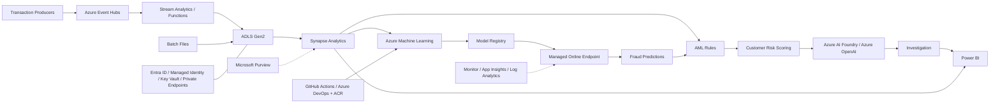

# Azure Reference Architecture

> Reference design only. The repository implements the platform locally with synthetic data; it does not deploy or connect to Azure.

## Path Mapping

| Path | Local implementation | Azure deployment equivalent |
| --- | --- | --- |
| Streaming | JSONL transactions loaded with pandas | Event Hubs partitions, Functions or Stream Analytics, ADLS landing |
| Batch | CSV/JSONL files in `data/raw/` | Scheduled ingestion into ADLS Gen2 raw zone |
| Training | Feature scripts and sklearn pipeline | Synapse preparation, Azure ML jobs, registry, managed endpoint |
| Investigation | Deterministic evidence packets and narratives | AI Foundry orchestration with Azure OpenAI and human approval |
| Reporting | Governed CSV star model | Synapse serving layer and Power BI semantic model |
| Governance | Dictionaries, audit JSON, validation reports | Purview catalogue, lineage, classification, ownership |
| Security | No credentials; local files only | Entra ID, managed identities, Key Vault, RBAC, private endpoints, VNet integration |

The full Mermaid source in `diagrams/azure_reference_architecture.mmd` includes supporting operational and security services. Network controls and service selections are conceptual until subscription, region, quota, and organisational policies are known.
